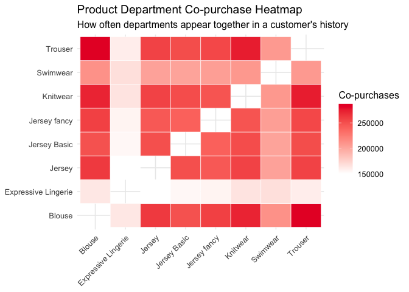
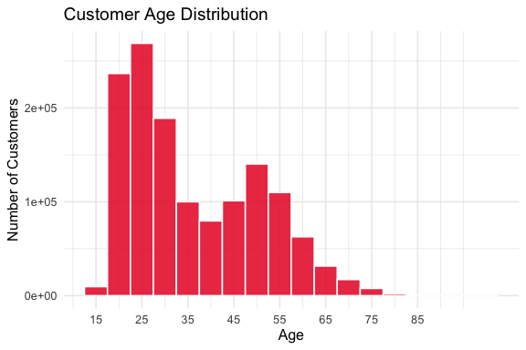
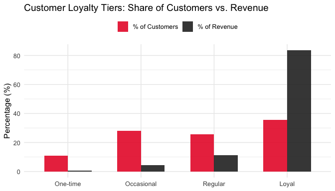
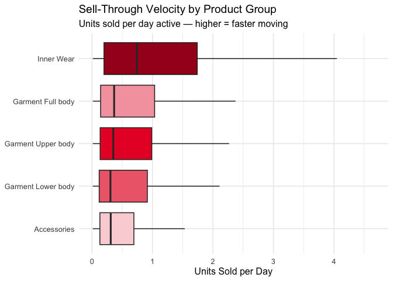

Customer Behavior and Product Performance Analysis in Fashion
E-Commerce: A Study Using H&M Transaction Data
================
Tanisha Magikar, Nikhil Kumar, Bhavika Rathi, Favour Forchu
May 04, 2026

## Research Topic

**Customer Behavior and Product Performance Analysis in Fashion
E-Commerce: A Study Using H&M Transaction Data**

------------------------------------------------------------------------

## Team Members

- Tanisha Magikar
- Nikhil Kumar
- Bhavika Rathi
- Favour Forchu

## Data Description

### Dataset

We are using the **H&M Personalized Fashion Recommendations** dataset,
publicly available on Kaggle as part of a competition hosted by H&M
Group.

**Dataset Link:**
<https://www.kaggle.com/competitions/h-and-m-personalized-fashion-recommendations/data>

The dataset contains three primary files:

- **`transactions_train.csv`** — Purchase-level records including
  customer ID, article ID, price, and purchase date.
- **`articles.csv`** — Article (product) metadata including product
  type, group name, department name, color, and more.
- **`customers.csv`** — Customer-level attributes including age,
  membership status, and postal code.

``` r
library(tidyverse)   
library(lubridate)  
library(scales)      
library(knitr)       
```

``` r
transactions <- read_csv("data/transactions_train.csv", show_col_types = FALSE)
articles     <- read_csv("data/articles.csv", show_col_types = FALSE)
customers    <- read_csv("data/customers.csv", show_col_types = FALSE)
```

------------------------------------------------------------------------

### Anticipated Data Cleaning Steps

The following cleaning steps are planned before analysis begins:

1.  **Handle missing values** — Inspect each data frame for `NA`s.
    Decide on a per-column basis whether to drop rows (e.g., missing
    `customer_id`) or impute (e.g., median imputation for `age`).

2.  **Remove duplicates** — Deduplicate rows in all three files,
    particularly in `transactions_train.csv` where repeated purchase
    records could inflate counts.

3.  **Convert data types** — Parse `t_dat` to `Date`, ensure
    `article_id` and `customer_id` are character strings, and convert
    relevant columns to factors.

4.  **Merge datasets and standardize categorical variables** — Join
    `transactions` with `articles` and `customers` on their shared keys.
    Standardize categorical columns (e.g., trim whitespace, unify
    casing) to avoid spurious category splits.

5.  **Handle outliers** — After exploratory analysis, examine extreme
    values in `price`, transaction frequency, and customer age. Apply
    domain-appropriate treatment (e.g., winsorizing prices, removing
    clearly erroneous ages).

6.  **Feature engineering** — Derive new columns to support the research
    questions, including:

    - `total_purchases_per_customer` — Transaction count per customer.
    - `recency` — Days since a customer’s most recent purchase.
    - `loyalty_tier` — Bucketed customer segments (one-time, occasional,
      regular, loyal).
    - `sell_through_velocity` — Units sold divided by days the product
      was active.

``` r
colSums(is.na(transactions))
```

    ##            t_dat      customer_id       article_id            price 
    ##                0                0                0                0 
    ## sales_channel_id 
    ##                0

``` r
colSums(is.na(customers))
```

    ##            customer_id                     FN                 Active 
    ##                      0                 895050                 907576 
    ##     club_member_status fashion_news_frequency                    age 
    ##                   6062                  16009                  15861 
    ##            postal_code 
    ##                      0

``` r
colSums(is.na(articles))
```

    ##                   article_id                 product_code 
    ##                            0                            0 
    ##                    prod_name              product_type_no 
    ##                            0                            0 
    ##            product_type_name           product_group_name 
    ##                            0                            0 
    ##      graphical_appearance_no    graphical_appearance_name 
    ##                            0                            0 
    ##            colour_group_code            colour_group_name 
    ##                            0                            0 
    ##    perceived_colour_value_id  perceived_colour_value_name 
    ##                            0                            0 
    ##   perceived_colour_master_id perceived_colour_master_name 
    ##                            0                            0 
    ##                department_no              department_name 
    ##                            0                            0 
    ##                   index_code                   index_name 
    ##                            0                            0 
    ##               index_group_no             index_group_name 
    ##                            0                            0 
    ##                   section_no                 section_name 
    ##                            0                            0 
    ##             garment_group_no           garment_group_name 
    ##                            0                            0 
    ##                  detail_desc 
    ##                          416

``` r
# Clean transactions
transactions_clean <- transactions %>%
  mutate(
    t_dat = as.Date(t_dat),
    customer_id = as.character(customer_id),
    article_id = as.character(article_id)
  ) %>%
  distinct() %>%
  filter(
    !is.na(customer_id),
    !is.na(article_id),
    !is.na(t_dat),
    !is.na(price)
  )

# Clean customers
customers_clean <- customers %>%
  mutate(
    customer_id = as.character(customer_id),
    age = as.numeric(age)
  ) %>%
  distinct() %>%
  filter(is.na(age) | between(age, 16, 100))

# Clean articles
articles_clean <- articles %>%
  mutate(
    article_id = as.character(article_id),
    across(where(is.character), str_trim)
  ) %>%
  distinct()

# Customer-level feature engineering
reference_date <- max(transactions_clean$t_dat, na.rm = TRUE)

customer_features <- transactions_clean %>%
  group_by(customer_id) %>%
  summarise(
    total_purchases_per_customer = n(),
    recency = as.numeric(reference_date - max(t_dat, na.rm = TRUE)),
    .groups = "drop"
  ) %>%
  mutate(
    loyalty_tier = case_when(
      total_purchases_per_customer == 1 ~ "one-time",
      total_purchases_per_customer <= 5 ~ "occasional",
      total_purchases_per_customer <= 20 ~ "regular",
      TRUE ~ "loyal"
    )
  )

# Product-level feature engineering
article_features <- transactions_clean %>%
  group_by(article_id) %>%
  summarise(
    total_units_sold = n(),
    first_sale_date = min(t_dat, na.rm = TRUE),
    last_sale_date = max(t_dat, na.rm = TRUE),
    active_days = as.numeric(last_sale_date - first_sale_date) + 1,
    .groups = "drop"
  ) %>%
  mutate(
    sell_through_velocity = total_units_sold / active_days
  )

# Avoid building one giant joined table in memory for the full transaction history
glimpse(customer_features)
```

    ## Rows: 1,362,281
    ## Columns: 4
    ## $ customer_id                  <chr> "00000dbacae5abe5e23885899a1fa44253a17956…
    ## $ total_purchases_per_customer <int> 19, 78, 15, 2, 13, 3, 6, 113, 2, 4, 3, 15…
    ## $ recency                      <dbl> 17, 76, 7, 471, 41, 356, 8, 132, 261, 680…
    ## $ loyalty_tier                 <chr> "regular", "loyal", "regular", "occasiona…

``` r
glimpse(article_features)
```

    ## Rows: 104,547
    ## Columns: 6
    ## $ article_id            <chr> "0108775015", "0108775044", "0108775051", "01100…
    ## $ total_units_sold      <int> 7535, 5666, 177, 982, 482, 1018, 4189, 41, 10287…
    ## $ first_sale_date       <date> 2018-09-20, 2018-09-20, 2018-09-20, 2018-09-20,…
    ## $ last_sale_date        <date> 2020-07-22, 2020-09-20, 2019-06-28, 2020-08-02,…
    ## $ active_days           <dbl> 672, 732, 282, 683, 686, 713, 734, 98, 734, 734,…
    ## $ sell_through_velocity <dbl> 11.21279762, 7.74043716, 0.62765957, 1.43777452,…

------------------------------------------------------------------------

## Basic / Marginal Summaries Planned

- Distribution of customer ages (histogram)
- Overall transaction volume over time (line chart)
- Top 10 most purchased product departments (bar chart)
- Summary statistics for `price` (mean, median, IQR)
- Count of unique customers vs. unique articles purchased

------------------------------------------------------------------------

## Project Idea / Research Questions

### What Are We Trying to Investigate?

We aim to understand **how customers interact with fashion products** in
an e-commerce setting — specifically looking at purchasing patterns,
customer loyalty, and product performance. The four core research
questions are:

> **RQ1:** What items are frequently bought together?

> **RQ2:** What does the age distribution of customers look like, and do
> different age groups buy different product types?

> **RQ3:** What is the repeat purchase rate? How many customers buy once
> versus becoming regulars?

> **RQ4:** Which items sell quickly versus sitting in inventory?

------------------------------------------------------------------------

## Main Skepticism and limitations

This analysis is limited by the structure of the dataset. The data we
get is only the completed transactions and we have no ability to capture
the browsing, abandoned carts, or untapped demand. Also, the lack of
missing or incomplete demographic data (e.g., age) can also bias the
outcomes of customer segmentation.

The sell-through velocity measure is also an approximation, as actual
inventory status and inventory availability is not given. Consequently,
certain products might not seem to move swiftly merely because of low
supply and not low demand.

## Analyses and Visualizations

### RQ1 — Product Affinity (Co-purchase Analysis)

We will count how often pairs of product categories appear together in
the **same customer’s overall purchase history**. The results will be
displayed as a **co-purchase heatmap**, where both axes represent
product departments and fill color encodes co-purchase frequency.

``` r
tx_dept <- transactions_clean %>%
  left_join(articles_clean %>% select(article_id, department_name),
            by = "article_id")
top_depts <- tx_dept %>%
  count(department_name, sort = TRUE) %>%
  slice_head(n = 8) %>%
  pull(department_name)

copurchase <- tx_dept %>%
  filter(department_name %in% top_depts) %>%
  select(customer_id, department_name) %>%
  distinct() %>%
  mutate(value = 1L)

co_matrix <- xtabs(value ~ customer_id + department_name, data = copurchase)
co_counts <- as.matrix(t(co_matrix) %*% co_matrix)
diag(co_counts) <- 0

copurchase <- as_tibble(as.data.frame(as.table(co_counts))) %>%
  rename(
    department_name.x = department_name,
    department_name.y = department_name.1,
    CoCount = Freq
  ) %>%
  filter(CoCount > 0)

ggplot(copurchase, aes(x = department_name.x, y = department_name.y, fill = CoCount)) +
  geom_tile(color = "white") +
  scale_fill_gradient(low = "white", high = "#E8002D", name = "Co-purchases") +
  labs(title = "Product Department Co-purchase Heatmap",
       subtitle = "How often departments appear together in a customer's history",
       x = NULL, y = NULL) +
  theme_minimal(base_size = 12) +
  theme(axis.text.x = element_text(angle = 45, hjust = 1))
```

<!-- -->

------------------------------------------------------------------------

### RQ2 — Age Distribution

Customers will be binned into age groups (e.g., 16–24, 25–34, 35–49,
50–64, 65+). We will use:

- A **histogram** of the overall age distribution to see which age group
  buys the most products.

``` r
ggplot(customers_clean, aes(x = age)) +
  geom_histogram(binwidth = 5, fill = "#E8002D", color = "white", alpha = 0.85) +
  scale_x_continuous(breaks = seq(15, 85, 10)) +
  labs(title = "Customer Age Distribution",
       x = "Age", y = "Number of Customers") +
  theme_minimal(base_size = 12)
```

<!-- -->

------------------------------------------------------------------------

### RQ3 — Repeat Purchase Rate / Loyalty Tiers

Customers will be classified into **loyalty tiers** based on total
transaction counts:

| Tier       | Definition         |
|------------|--------------------|
| One-time   | Exactly 1 purchase |
| Occasional | 2–5 purchases      |
| Regular    | 6–15 purchases     |
| Loyal      | 16+ purchases      |

Side-by-side bar charts will compare the **share of customers**
vs. **share of revenue** per tier — to show whether loyal customers are
disproportionately valuable.

``` r
loyalty_real <- transactions_clean %>%
  count(customer_id, name = "n_purchases") %>%
  mutate(Tier = case_when(
    n_purchases == 1  ~ "One-time",
    n_purchases <= 5  ~ "Occasional",
    n_purchases <= 15 ~ "Regular",
    TRUE              ~ "Loyal"
  ))

tier_revenue <- transactions_clean %>%
  left_join(loyalty_real, by = "customer_id") %>%
  group_by(Tier) %>%
  summarise(total_revenue = sum(price, na.rm = TRUE))

tier_summary <- loyalty_real %>%
  count(Tier, name = "n_customers") %>%
  left_join(tier_revenue, by = "Tier") %>%
  mutate(
    Pct_Customers = n_customers / sum(n_customers) * 100,
    Pct_Revenue   = total_revenue / sum(total_revenue) * 100,
    Tier = factor(Tier, levels = c("One-time","Occasional","Regular","Loyal"))
  ) %>%
  pivot_longer(cols = c(Pct_Customers, Pct_Revenue),
               names_to = "Metric", values_to = "Percentage") %>%
  mutate(Metric = recode(Metric,
                         "Pct_Customers" = "% of Customers",
                         "Pct_Revenue"   = "% of Revenue"))

ggplot(tier_summary, aes(x = Tier, y = Percentage, fill = Metric)) +
  geom_col(position = "dodge", width = 0.65, alpha = 0.88) +
  scale_fill_manual(values = c("% of Customers" = "#E8002D",
                               "% of Revenue"   = "#222222")) +
  labs(title = "Customer Loyalty Tiers: Share of Customers vs. Revenue",
       x = NULL, y = "Percentage (%)", fill = NULL) +
  theme_minimal(base_size = 12) +
  theme(legend.position = "top")
```

<!-- -->

------------------------------------------------------------------------

### RQ4 — Inventory Velocity (Fast vs. Slow-moving Products)

For each product, we will compute a **sell-through velocity** = units
sold / days active in the dataset. A **box plot** of units sold (y-axis)
vs. days active (x-axis), colored by product category, will reveal
fast-moving vs. stagnant inventory.

``` r
velocity <- transactions_clean %>%
  group_by(article_id) %>%
  summarise(
    units_sold  = n(),
    days_active = as.numeric(max(t_dat) - min(t_dat)) + 1,
    velocity    = units_sold / days_active
  ) %>%
  left_join(articles_clean %>% select(article_id, product_group_name),
            by = "article_id") %>%
  filter(!is.na(product_group_name), days_active > 1)

top_groups <- velocity %>%
  count(product_group_name, sort = TRUE) %>%
  slice_head(n = 5) %>%
  pull(product_group_name)

velocity %>%
  filter(product_group_name %in% top_groups) %>%
  mutate(product_group_name = recode(product_group_name,
                                     "Underwear" = "Inner Wear")) %>%
  ggplot(aes(x = reorder(product_group_name, velocity, median),
             y = velocity, fill = product_group_name)) +
  geom_boxplot(outlier.shape = NA) +
  coord_flip() +
  scale_y_continuous(limits = quantile(
    velocity$velocity[velocity$product_group_name %in% top_groups],
    c(0.01, 0.95), na.rm = TRUE)) +
  scale_fill_manual(values = c(
  "#FAD4D8",
  "#F5A3AD",
  "#EF6B7A",
  "#E8002D",
  "#A60021"
)) +
  labs(title    = "Sell-Through Velocity by Product Group",
       subtitle = "Units sold per day active — higher = faster moving",
       x = NULL,
       y = "Units Sold per Day",
       fill = NULL) +
  theme_minimal(base_size = 12) +
  theme(legend.position = "none")
```

<!-- -->

------------------------------------------------------------------------

## Conclusions

This project examined the behavior of customers and the performance of
products in a fashion e-commerce environment using the H&M transaction
data. The analysis shows that the purchasing patterns differ across the
type of product and group of customers and that some of the departments
are often co-occurring in the purchase history of the customer.

We also see that customer loyalty is a major aspect, with a small number
of repeat customers providing a considerable portion of the total
revenue. Also, different products have varying velocity, which implies
that demand varies among the categories.

Such results can be used to shape marketing efforts, targeting customers
and inventory choices. The next generation of work might include some
extra data like browsing history or stock level to have a more in-depth
picture of customer intent and product performance.

------------------------------------------------------------------------
